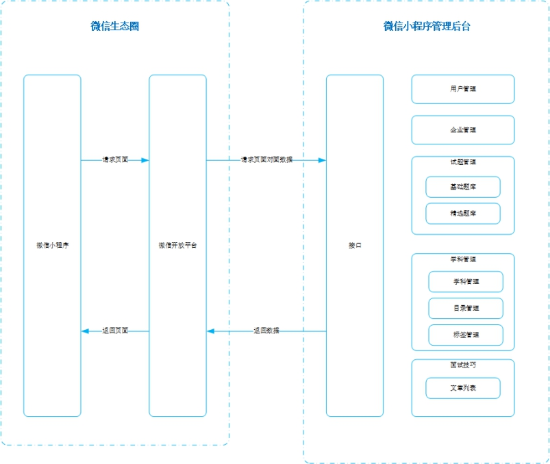
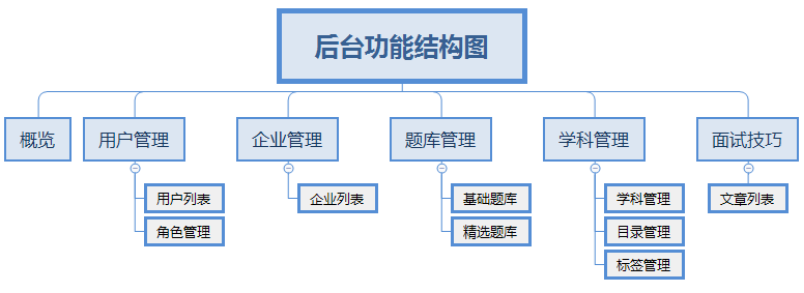

## 项目介绍

### 01-项目背景

​	针对目前大量学员在培训完之后直接去面试企业的通过率低的问题，公司研发了黑马面面小程序，学员在空闲时间可以通过查看企业真实面试题，不仅可以查看企业真题，也可以通过刷题寻找自己的短板进行补充，新版本提供模拟面试功能，用户可以通过微信小程序进入模拟面试模块，完成定向企业面试和自由组题模式。

​	需要对微信小程序需要的试题数据、面试技巧进行管理，所以需要开发一个**后台管理系统**。该后台管理系统包含：权限管理，用户管理，角色管理，企业管理，试题管理，学科管理，面试技巧等功能。从而去对黑马面面小程序进行支撑。

### 02-产品介绍

产品logo：

产品名称：黑马面面后台管理系统

产品简介：黑马面面是一款面向程序员的面试刷题小程序，旨在帮助更多程序员通过对各公司面试真题的了解，提高在企业面试的通过率。需要对微信小程序需要的试题数据、面试技巧进行管理，所以需要开发一个后台管理系统。

产品定位：后台管理系统，帮助运营人员快速的录入面试题

目标人群：IT 行业面试者

使用场景：面试刷题/模拟面试

### 03-功能介绍

| 序号 | 模块  | 子模块   | 描述                                                         | 完成 |
| ---- | ----- | -------- | ------------------------------------------------------------ | ---- |
| 1    |       | 角色管理 | 通过添加角色并对不同角色赋予不用的权限从而完成对系统中试题录入、试题管理、试题审核等角色的配置 |      |
| 2    |       | 用户管理 | 用户中包括微信小程序登录用户以及后台添加的管理员用户         |      |
| 3    |       | 企业管理 | 管理平台中所有添加的企业，并完成对企业的相关管理功能         |      |
| 4    |       | 基础题库 | 可查看题库中的基础题库，可完成新增、批量导入、筛选、预览、修改、删除、加入精选操作。 |      |
| 5    |       | 精选题库 | 可查看题库中的精选题库，可完成试题的新增、批量导入、筛选、预览、审核、修改、删除、状态修改 |      |
| 6    |       | 试题录入 | 可通过学科、方向等条件完成试题的添加，试题添加分为单选、多选、简答三个类型，每种题型可分为一般、简单、困难。 |      |
| 7    |       | 试题审核 | 进入精选题库的试题会进入审核流程，并由具有审核权限的管理员完成审核，如审核未通过则会在提交人的列表中进行展示。 |      |
| 8    |       | 试题预览 | 在试题列表可完成试题预览，展示试题的所有详细信息，如为精选题库则会显示审核历史入口。 |      |
| 9    |       | 组题列表 | 该列表中显示的所有模拟面试的组题结果，会将用户每次的组题全部进行保存，并显示用户对该套试卷的完成情况。 |      |
| 10   |       | 学科管理 | 可查看平台中已经录入学科，可完成学科的增删改查操作同时提供学科下二级目录、标签管理的入口。 |      |
| 11   |       | 目录管理 | 可查看平台中所有面试题的分类目录，目录归属于学科下，通过学科中的目录管理进行管理 |      |
| 12   |       | 标签管理 | 管理题库中试题的标签，标签归属学科下，不同学科的标签不可混用，添加时仅可使用本学科下的标签 |      |
| 13   |       | 文章列表 | 显示管理元提交的所有面试技巧文章或视频，通过输入文章标题 正文或视频地址完成对面试技巧的添加 |      |
| %%%  | %%%%% | %%%%%    |                                                              | %%%  |