## 项目需求

> 相关资源：
>
> - [产品原型](http://czpm.itcast.cn/黑马面面/V2.0/#g=1&p=概览 )
> - http://destiny001.gitee.io/hmmm-view/#/dashboard
> - 设计图
> - [参考图]( https://lanhuapp.com/web/#/item/project/board?pid=68387021-56ba-4a61-b49e-ccd75326b133 )  
> - 需求文档
>
> **以参考图+需求文档为准，产品原型+设计稿仅供参考**

### 01-题库管理-基础题库

#### 1.1筛选区域

**学科**下拉菜单，根据后台学科列表数据渲染下拉选项。

**二级目录**下拉菜单，默认无选项数据，它属于某个学科，所以当学科选择后，加载对应的二级目录列表数据渲染下拉选项。

**标签**下拉菜单，默认无选项数据，它属于某个学科，所以当学科选择后，加载器对应的标签列表数据渲染下拉选项。

**关键字**输入框

**试题类型**下拉菜单，根据前后端约定规则，初始化下拉选项。

-  单选 --->  1
-  多选 --->  2
-  简单 --->  3

**难度**下拉菜单，根据前后端约定规则，初始化下拉选项。

-  简单 --->  1
-  一般 --->  2
-  困难 --->  3

**方向**下拉菜单，根据前后端约定规则，初始化下拉选项。

-  o2o，外包服务，企业服务，互联网金融，企业咨询，互联网，电子商务，其他

**录入人**下拉菜单，根据后台用户列表数据渲染下拉选项。

**题目备注**输入框

**企业简称**输入框

**城市**下拉菜单

- 第一个下拉框，获取所有城市数据渲染下拉选项。
- 第二个下拉框，默认无选项数据，它属于某个城市，所以当城市选择后，加载器对应的地区列表数据渲染下拉选项。

点击**清除**按钮，清空所有之前输入或选择的筛选项数据。

点击**筛选**按钮，根据输入或选择的筛选条件，查询第一页基础题库数据且渲染列表。

#### 1.2列表区域

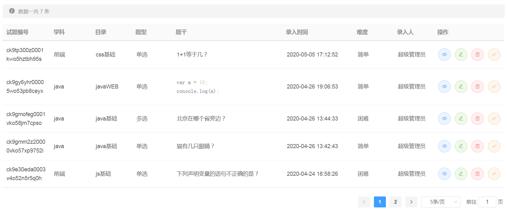

布局：数量区域、表格区域、分页区域。

分页：

- 在进入基础题库后立即加载第一页数据并进行渲染。
- 当用户点击分页按钮时需要按照当前点击分页页码切换列表内容。
- 当用户选择分页条数时需要安装当前选中分页条数且回到第一页进行列表渲染。
- 当用户输入页码的时候，按下回车键，将列表切换到当前输入页码对应数据。

#### 1.3添加功能

当用户点击（新增试题）按钮的时候，跳转到试题录入即可。

#### 1.4预览功能

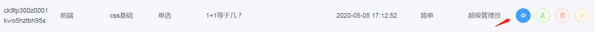

当用户点击（预览）按钮的时候，不同题型弹出对话框内容：

- 单选预览效果

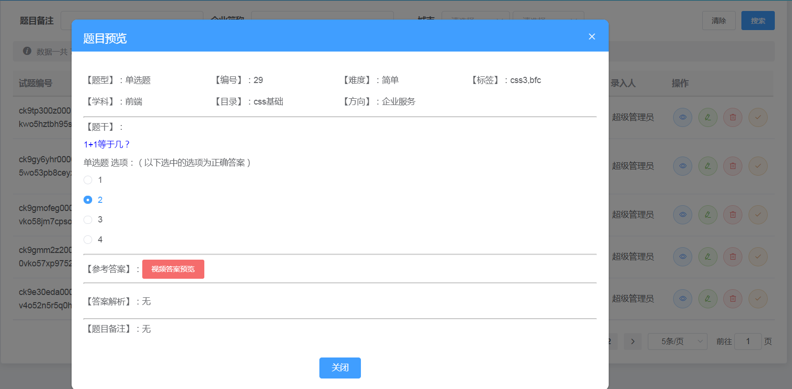

- 多选预览效果

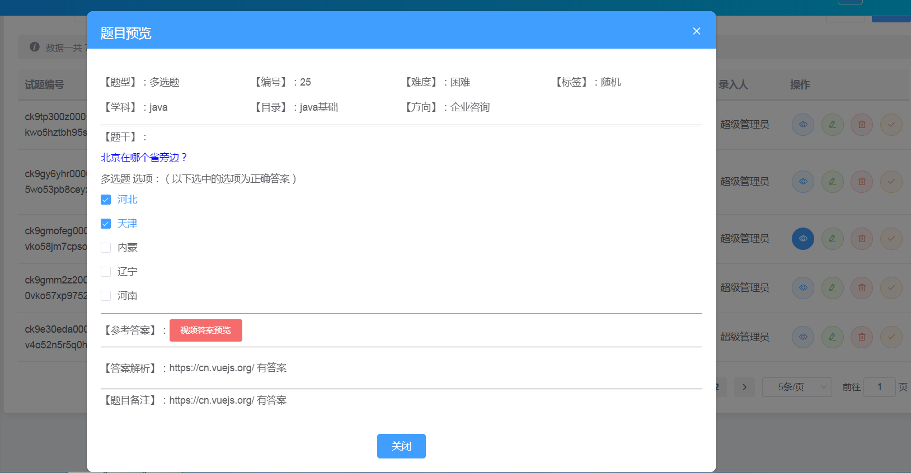

- 简答预览效果

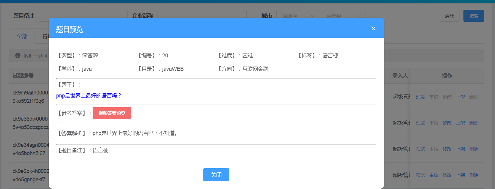

当用户点击（视频答案预览）按钮时，按钮的下方显示视频播放器且开始播放解析视频。

注意：如果无视频连接，不打开播放器即可。

#### 1.5修改功能

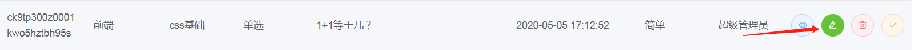

当用户点击（修改）按钮的时候，跳转到试题录入即可。需要在地址栏携带试题ID方可区分新增与修改。

#### 1.6删除功能

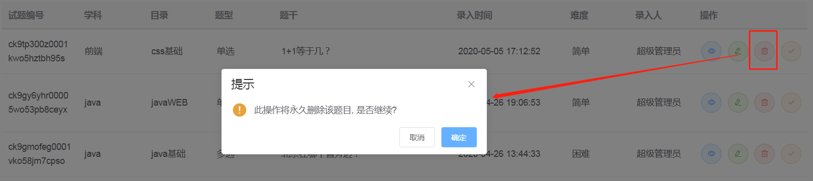

当用户点击（删除）按钮的时候，弹出警告确认框，点击确认后，删除当前试题，成功后：提示删除成功+更新当前列表。

#### 1.7加入精选

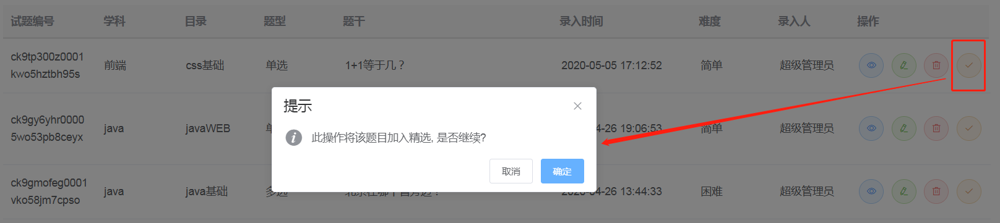

当用户点击（加入精选）按钮的时候，弹出信息确认框，点击确认后，将当前试题加入精选题库，成功后：提示加入精选题库成功+跳转到精选题库。

### 02-题库管理-精选题库

#### 2.1筛选区域

**学科**下拉菜单，根据后台学科列表数据渲染下拉选项。

**二级目录**下拉菜单，默认无选项数据，它属于某个学科，所以当学科选择后，加载器对应的二级目录列表数据渲染下拉选项。

**标签**下拉菜单，默认无选项数据，它属于某个学科，所以当学科选择后，加载器对应的标签列表数据渲染下拉选项。

**关键字**输入框

**试题类型**下拉菜单，根据前后端约定规则，初始化下拉选项。

-  单选 --->  1
-  多选 --->  2
-  简单 --->  3

**难度**下拉菜单，根据前后端约定规则，初始化下拉选项。

-  简单 --->  1
-  一般 --->  2
-  困难 --->  3

**方向**下拉菜单，根据前后端约定规则，初始化下拉选项。

-  o2o，外包服务，企业服务，互联网金融，企业咨询，互联网，电子商务，其他

**录入人**下拉菜单，根据后台用户列表数据渲染下拉选项。

**题目备注**输入框

**企业简称**输入框

**城市**下拉菜单

- 第一个下拉框，获取所有城市数据渲染下拉选项。
- 第二个下拉框，默认无选项数据，它属于某个城市，所以当城市选择后，加载器对应的地区列表数据渲染下拉选项。

点击**清除**按钮，清空所有之前输入或选择的筛选项数据。

点击**筛选**按钮，根据输入或选择的筛选条件，查询第一页精选题库数据且渲染列表。

#### 2.2列表区域

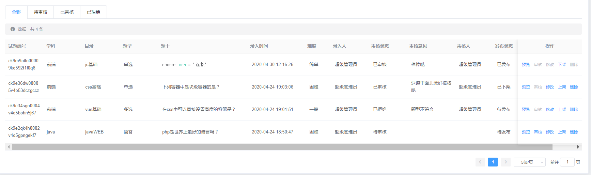

布局：tab选项卡、数量区域、表格区域、分页区域。

切换：当切换选项卡的时候，需要根据题状态且回到第一页查询对应精选试题列表，更新列表。

分页：

- 在进入基础题库后立即加载第一页数据并进行渲染。
- 当用户点击分页按钮时需要按照当前点击分页页码切换列表内容。
- 当用户选择分页条数时需要安装当前选中分页条数且回到第一页进行列表渲染。
- 当用户输入页码的时候，按下回车键，将列表切换到当前输入页码对应数据。

状态说明：

#### 2.3添加功能

当用户点击（新增试题）按钮的时候，跳转到试题录入即可。

#### 2.4预览试题

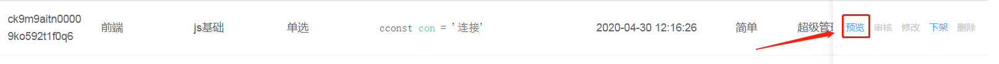

当用户点击（预览）按钮的时候，不同题型弹出对话框内容：

- 单选预览效果

- 多选预览效果

- 简答预览效果

当用户点击（视频答案预览）按钮时，按钮的下方显示视频播放器且开始播放解析视频。

注意：如果无视频连接，不打开播放器即可。

#### 2.5审核功能

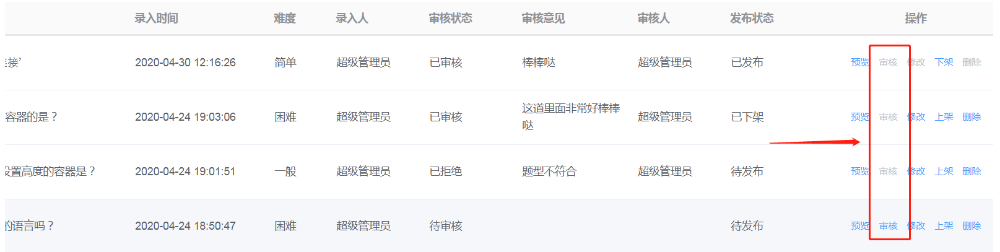

`注意：当试题已经审核过，那么此时（审核）按钮需要禁用。`

当用户点击（审核）按钮的时候，弹出对话框，可选择通过或拒绝操作，且需要输入审核意见，如果未输入使用经过提示‘请输入审核意见’，如果已经输入点击确认按钮后，提交后台进行审核，操作成功后：提示‘操作成功’+更新当前列表。

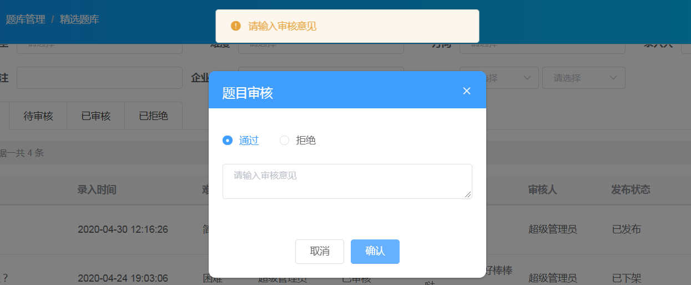

#### 2.6修改功能

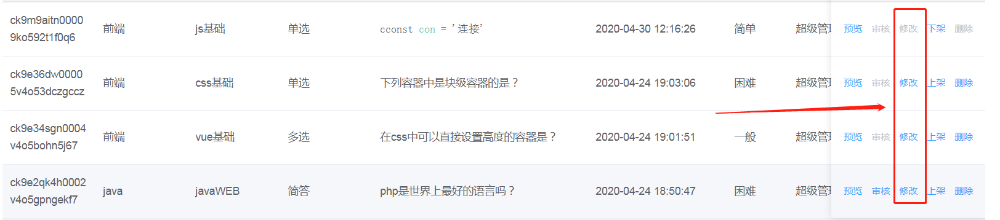

`注意：当试题已经上架，那么此时（修改）按钮需要禁用。`

当用户点击（修改）按钮的时候，跳转到试题录入即可。需要在地址栏携带试题ID方可区分新增与修改。

#### 2.7上架下架

`注意：当试题状态是上架那么按钮为：下架，当试题的状态是下架那么按钮为：上架。`

当用户点击（下架）按钮的时候如图：弹出确认框

当用户点击（上架）按钮的时候如图：弹出确认框

当用户点击确认按钮的时候，修改当前试题的（上架或下架）状态，修改成功后：提示‘操作成功’+更新当前列表。

#### 2.8删除功能

`注意：当试题已经上架，那么此时（删除）按钮需要禁用。`

当用户点击（删除）按钮的时候，弹出警告确认框，点击确认后，删除当前试题，成功后：提示删除成功+更新当前列表。

### 03-题库管理-试题录入

#### 3.1 基础布局

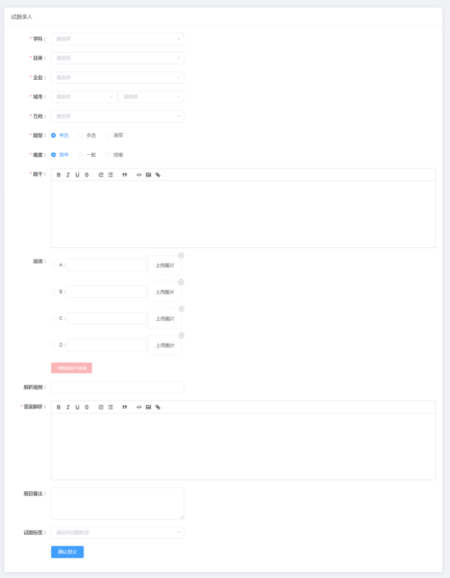

#### 3.2 初始化下拉框

`注意：城市有两个下拉框，默认初始化第一个：城市下拉框。然后选择完城市后获取地区选项数据去初始化地区下拉框。`

#### 3.3 学科联动

目录下拉框初始化：

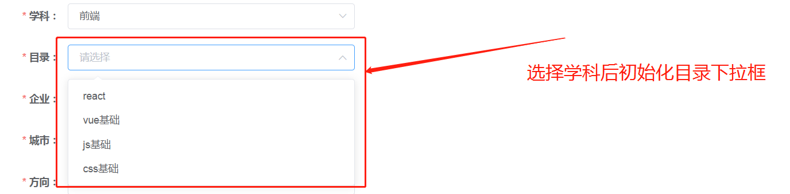

标签下拉框初始化：

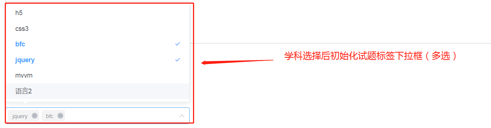

#### 3.4 试题类型联动

当用户选择 “单选”

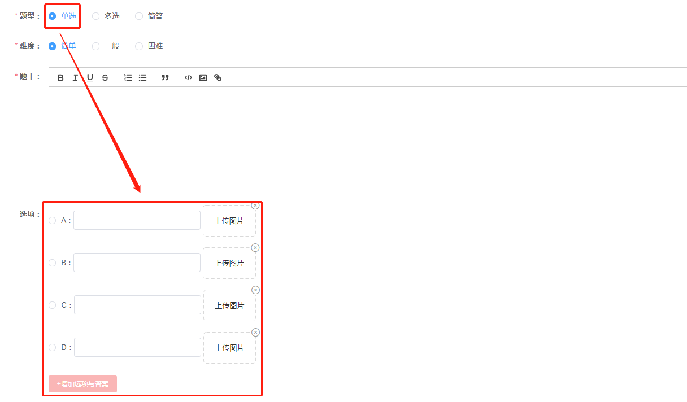

当用户选择 “多选”

当用户选择 “简答”

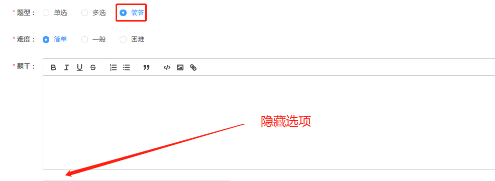

#### 3.5 富文本

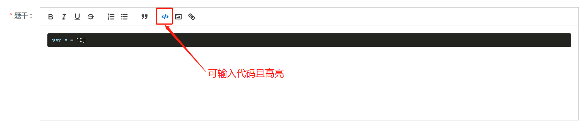

富文本值需要示图中的功能按钮，点击代码按钮的时候需要高亮即可。

#### 3.6 进行添加

- 点击确认提交按钮

- 先进行表单校验

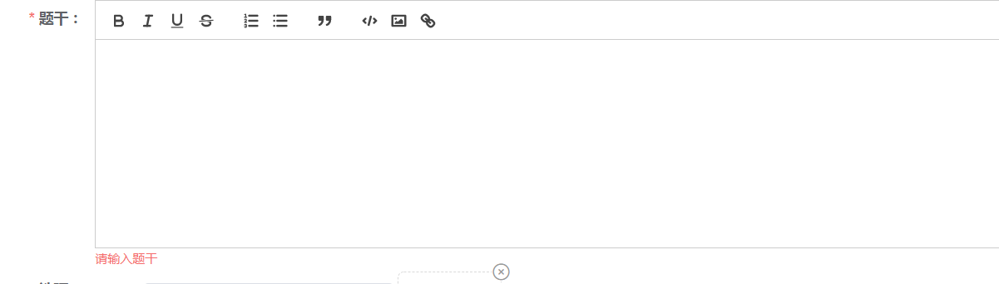

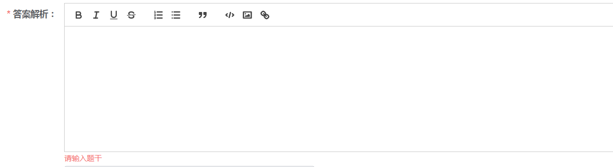

​		提示文字如图。

- 校验成功进行提交，录入成功后，提示“修改成功”+跳转到基础题库列表。

#### 3.7 进行修改

当用户通过（基础题库|精选题库）的修改按钮跳转过来之后：

- 卡片标题改变

- 内容填充

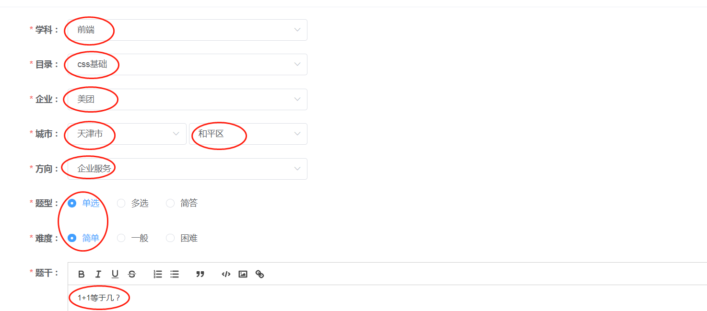

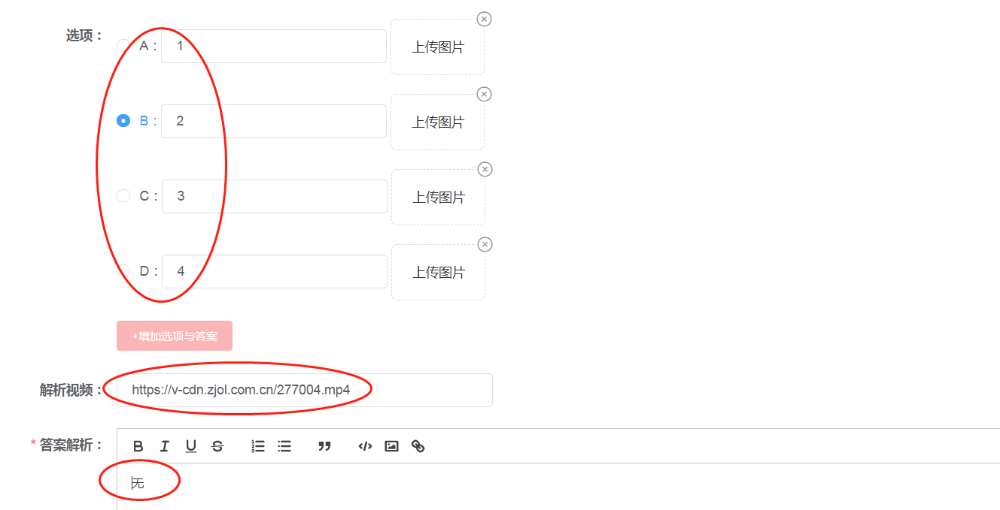

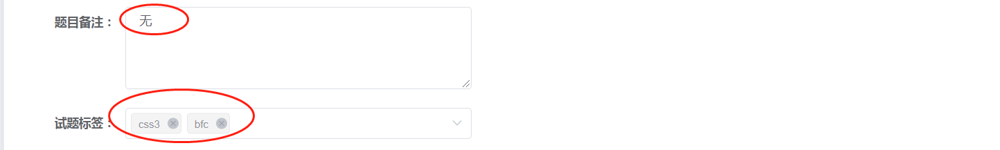

- 按钮切换

- 当从修改切换到添加，或添加切换到修改。需要对应进行改变。
  - 修改：标题（试题修改）+按钮（确认修改-绿色）+内容填充
  - 添加：标题（试题录入）+按钮（确认提交-蓝色）+内容重置
- 点击确认修改的时候，进行校验，校验成功后提交，修改成功后，提示“修改成功”+跳转到基础题库列表。

### 04-题库管理-组题列表

#### 4.1基础布局

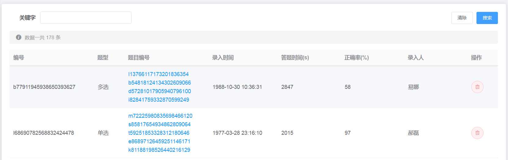

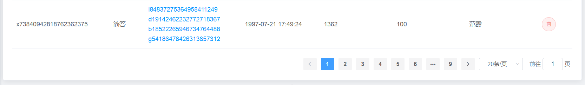

`注意：题组数据是mock的也就是模拟的，题目编号可试题编号有出路属于正常。`

#### 4.2列表功能

- 点击清除按钮，清空关键字输入框。
- 点击筛选按钮，按照用户输入的**关键字**且回到第一页进行查询，更新列表。
- 点击分页按钮，按照按钮的页码进行查询，更新列表。
- 选择条数下拉框，按照选择的条数且回到第一页进行查询，更新列表。
- 输入页码回车后，按照输入的页码进行查询，更新列表。
- 分页默认 20 条每页。
- 按照上图中的列进行渲染列表。

#### 4.3删除功能

点击删除按钮，弹出警告确认框：

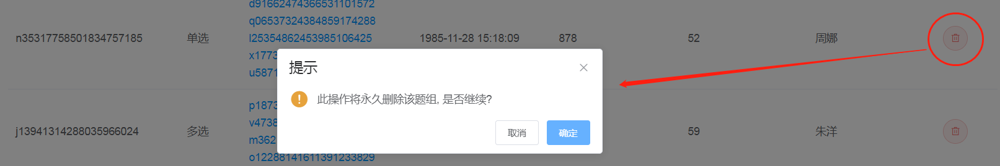

点击确认按钮，进行删除操作，如果操作成功：提示“删除成功”+更新当前列表

#### 4.4预览功能

点击题目编号列中 试题的编号  进行预览。

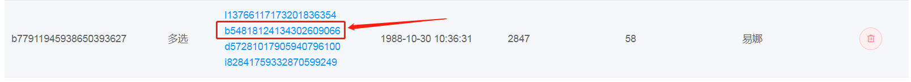

不同试题预览不一致，可参考（基础题库|精选题库）的试题预览实现。

- 单选预览效果

- 多选预览效果

- 简答预览效果

### 05-学科管理-学科

#### 5.1基础布局

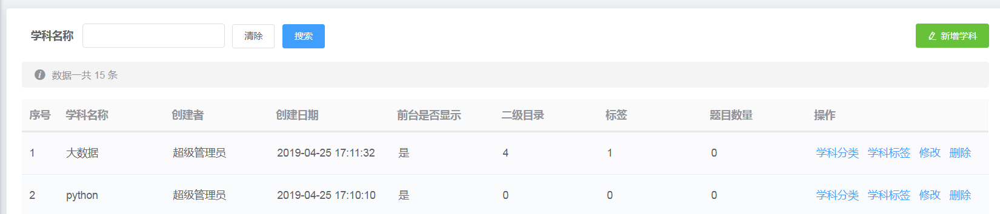

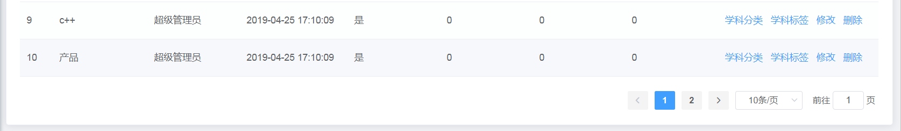

#### 5.2列表功能

- 点击清除按钮，清空关键字输入框。
- 点击筛选按钮，按照用户输入的**学科名称**且回到第一页进行查询，更新列表。
- 点击分页按钮，按照按钮的页码进行查询，更新列表。
- 选择条数下拉框，按照选择的条数且回到第一页进行查询，更新列表。
- 输入页码回车后，按照输入的页码进行查询，更新列表。
- 分页默认 10 条每页。
- 按照上图中的列进行渲染列表。

#### 5.3添加学科

当用户点击新增学科按钮的时候，弹出对话框：

当用户点击确认按钮的时候，进行校验：

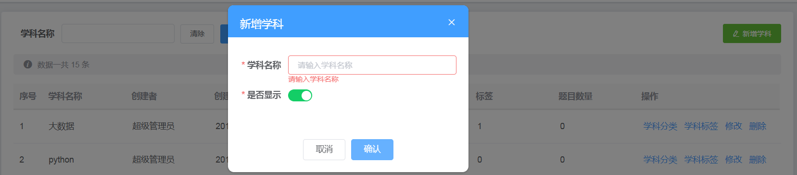

当校验通过后，方可发起新增。新增成功后：提示“新增学科成功”+回到第一页更新列表。

#### 5.4修改学科

当用户点击修改按钮的时候，弹出对话框：

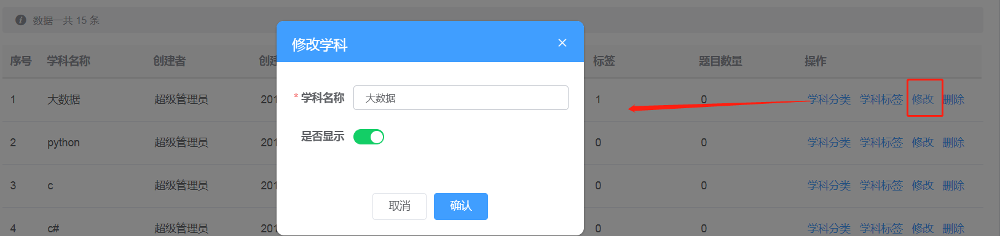

点击确认后且校验通过后，方可发起修改。修改成功后：提示“修改学科成功”+更新当前列表。

#### 5.5删除学科

当用户点击删除按钮，弹出警告确认框：

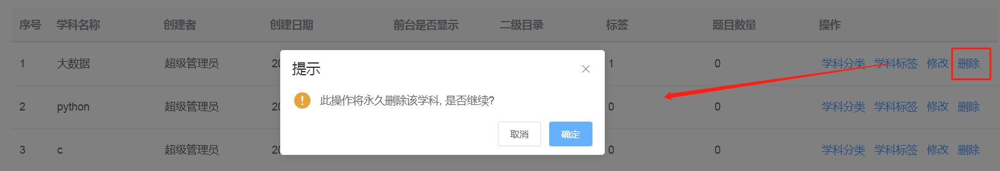

点击确认按钮，进行删除操作，如果操作成功：提示“删除成功”+更新当前列表

#### 5.6学科分类

当用户点击学科分类按钮，跳转到学科分类场景。

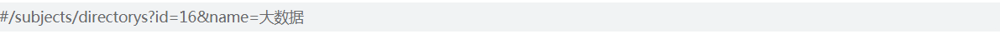

需要携带以上数据，学科分类方可开展在改学科下分类的操作。

#### 5.7学科标签

当用户点击学科分类按钮，跳转到学科标签场景。

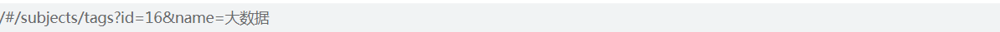

需要携带以上数据，学科分类方可开展在改学科下标签的操作。

### 06-学科管理-目录

#### 6.1基础布局

当用户从学科管理页面点击 “学科分类” 按钮来到目录管理的时候布局：

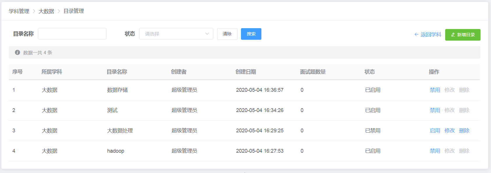

`注意：此处需要有面包屑标注来自哪个学科，需要有返回学科按钮点击后回到学科管理。`

当用户从左侧菜单点击进入目录管理的时候布局：

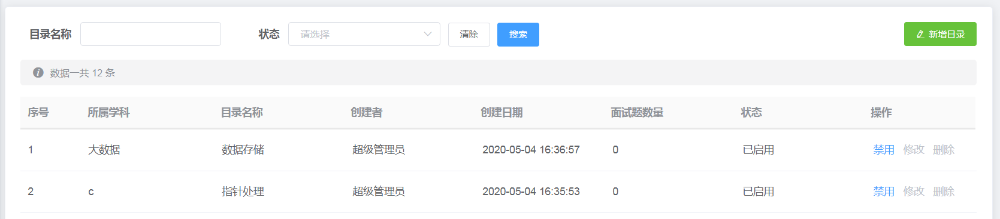

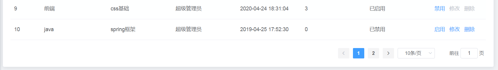

#### 6.2列表功能

`注意：如果是从学科进入目录的需要默认带上学科ID作为筛选条件。`

- 点击清除按钮，清空关键字输入框。
- 点击筛选按钮，按照用户输入的**目录名称**和选择的**状态**且回到第一页进行查询，更新列表。
  - 状态：已启用 ----> 1  已禁用 ----> 0
- 点击分页按钮，按照按钮的页码进行查询，更新列表。
- 选择条数下拉框，按照选择的条数且回到第一页进行查询，更新列表。
- 输入页码回车后，按照输入的页码进行查询，更新列表。
- 分页默认 10 条每页。
- 按照上图中的列进行渲染列表。

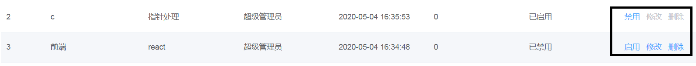

`注意，当目录是已启用状态，操作栏中的按钮：禁用按钮，修改和删除按钮需要不可用。`

`注意，当目录是已禁用状态，操作栏中的按钮：禁用按钮，修改和删除按钮需要可用。`

#### 6.3新增目录

当用户点击新增目录按钮的时候，弹出对话框：

`当前目录管理，从学科进入的时候`

`当前目录管理，从做菜单进入的时候`

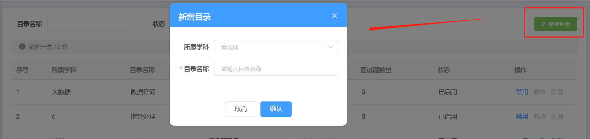

点击确认按钮的时候，进行必填校验，然后提交新增操作，成功后：提示“新增目录成功”+更新第一页列表。

#### 6.4修改目录

当用户点击每一行的修改按钮的时候，弹出对话框：

`当前目录管理，从学科进入的时候`

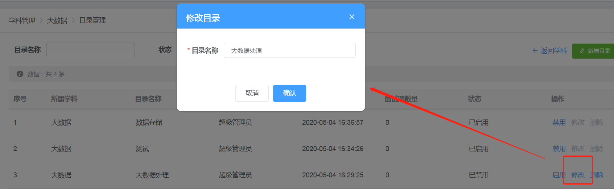

`当前目录管理，从左菜单进入的时候`

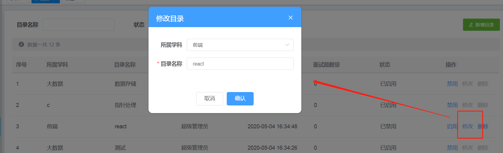

点击确认按钮的时候，进行必填校验，然后提交修改操作，成功后：提示“修改目录成功”+更新当前列表。

#### 6.5删除目录

当用户点击删除按钮，弹出警告确认框：

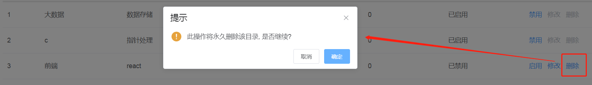

点击确认按钮，进行删除操作，如果操作成功：提示“删除成功”+更新当前列表

### 07-学科管理-标签

> 参照图中的 “目录” 就是 “标签” ， 大家写的时候注意。

#### 7.1基础布局

当用户从学科管理页面点击 “学科标签” 按钮来到标签管理的时候布局：

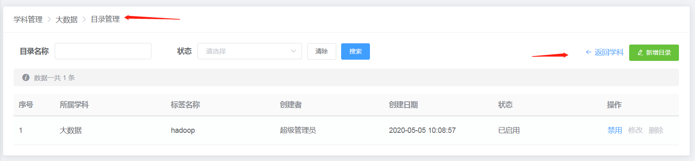

`注意：此处需要有面包屑标注来自哪个学科，需要有返回学科按钮点击后回到学科管理。`

当用户从左侧菜单点击进入目录管理的时候布局：

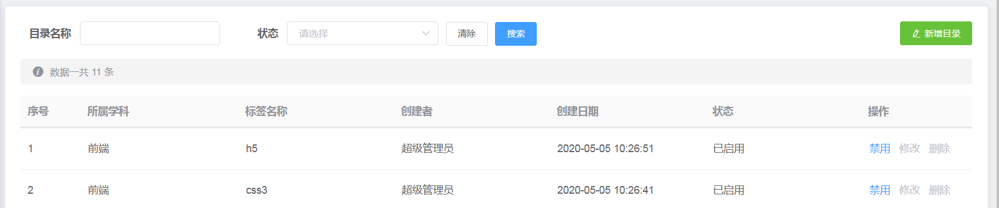

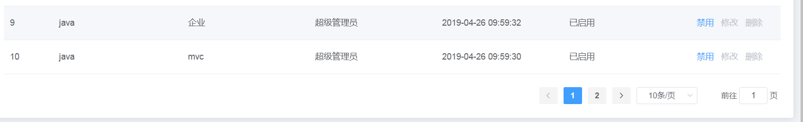

#### 7.2 列表功能

`注意：如果是从学科进入标签的需要默认带上学科ID作为筛选条件。`

- 点击清除按钮，清空关键字输入框。
- 点击筛选按钮，按照用户输入的**标签名称**和选择的**状态**且回到第一页进行查询，更新列表。
  - 状态：已启用 ----> 1  已禁用 ----> 0
- 点击分页按钮，按照按钮的页码进行查询，更新列表。
- 选择条数下拉框，按照选择的条数且回到第一页进行查询，更新列表。
- 输入页码回车后，按照输入的页码进行查询，更新列表。
- 分页默认 10 条每页。
- 按照上图中的列进行渲染列表。

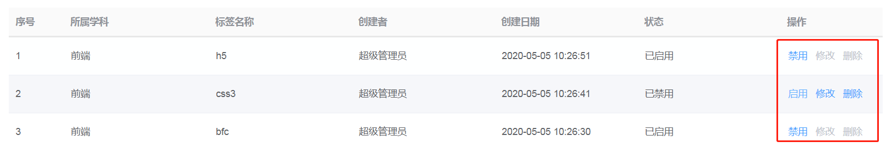

`注意，当标签是已启用状态，操作栏中的按钮：禁用按钮，修改和删除按钮需要不可用。`

`注意，当标签是已禁用状态，操作栏中的按钮：禁用按钮，修改和删除按钮需要可用。`

#### 7.3新增标签

当用户点击新增标签按钮的时候，弹出对话框：

`当前标签管理，从学科进入的时候`

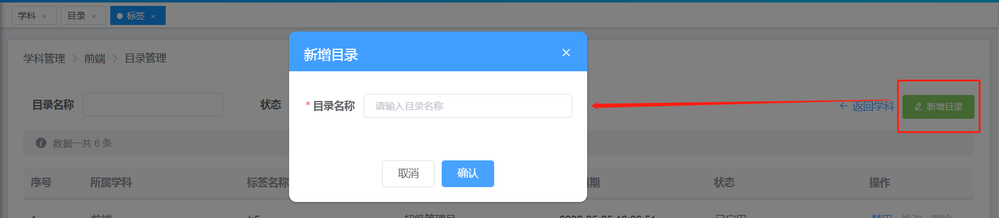

`当前标签管理，从左菜单进入的时候`

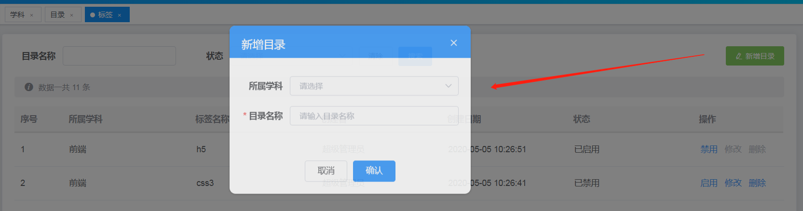

点击确认按钮的时候，进行必填校验，然后提交新增操作，成功后：提示“新增标签成功”+更新第一页列表。

#### 7.4 修改标签

当用户点击每一行的修改按钮的时候，弹出对话框：

`当前标签管理，从学科进入的时候`

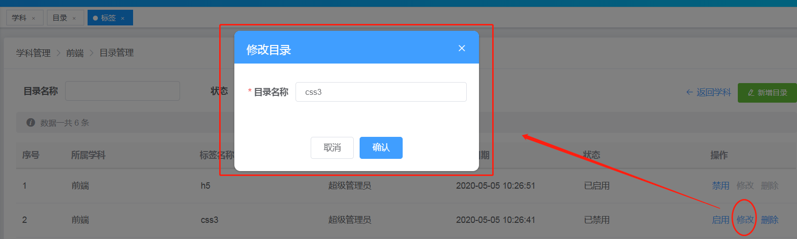

`当前标签管理，从左菜单进入的时候`

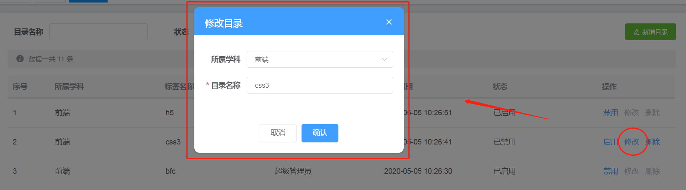

点击确认按钮的时候，进行必填校验，然后提交修改操作，成功后：提示“修改标签成功”+更新当前列表。

#### 7.5 删除标签

当用户点击删除按钮，弹出警告确认框：

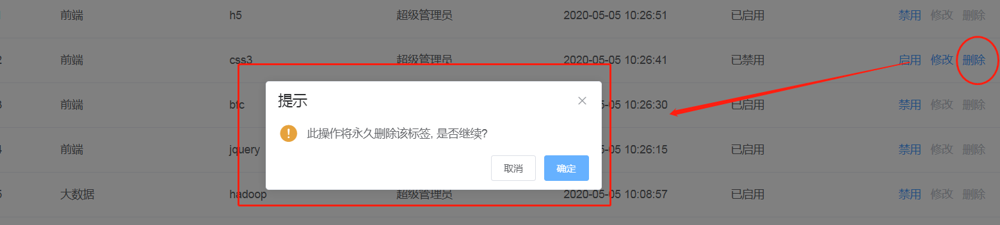

点击确认按钮，进行删除操作，如果操作成功：提示“删除成功”+更新当前列表

### 08-面试技巧

#### 8.1基础布局

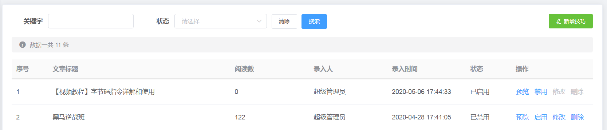

#### 8.2列表功能

- 点击清除按钮，清空关键字输入框。
- 点击筛选按钮，按照用户输入的**标签名称**和选择的**状态**且回到第一页进行查询，更新列表。
  - 状态：已启用 ----> 1  已禁用 ----> 0
- 点击分页按钮，按照按钮的页码进行查询，更新列表。
- 选择条数下拉框，按照选择的条数且回到第一页进行查询，更新列表。
- 输入页码回车后，按照输入的页码进行查询，更新列表。
- 分页默认 10 条每页。
- 按照图中的列进行渲染列表。

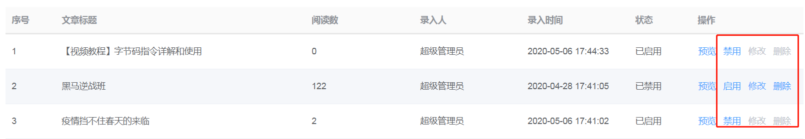

`注意，当文章是已启用状态，操作栏中的按钮：禁用按钮，修改和删除按钮需要不可用。`

`注意，当文章是已禁用状态，操作栏中的按钮：禁用按钮，修改和删除按钮需要可用。`

#### 8.3观看视频

当文章中包含视频链接的时候显示图中图标，且点击图标后可观看视频，打开播放器且自动播放：

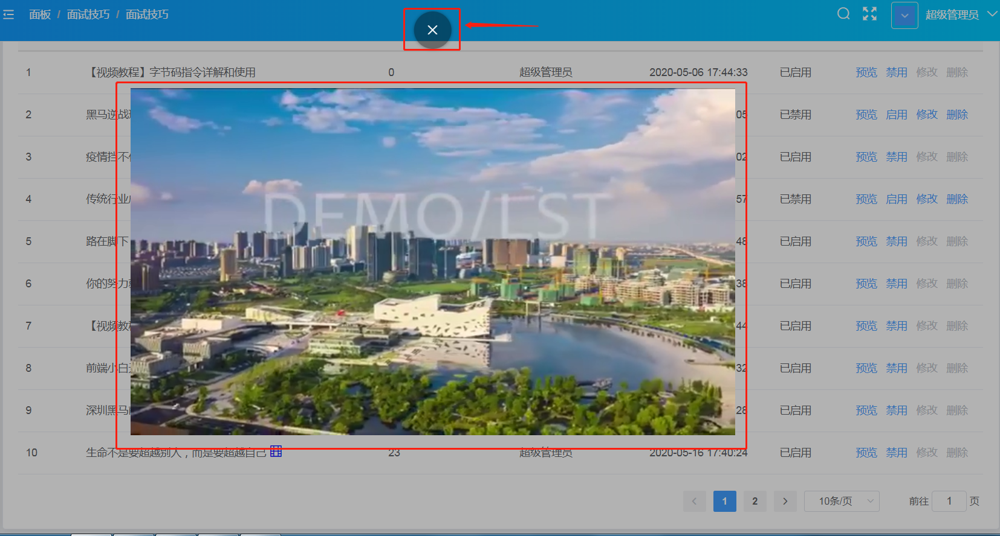

当点击close图标的时候，停止播放且关闭观看。

#### 8.4预览文章

当用户点击每一行数据中的预览按钮的时候，打开预览文章对话框：

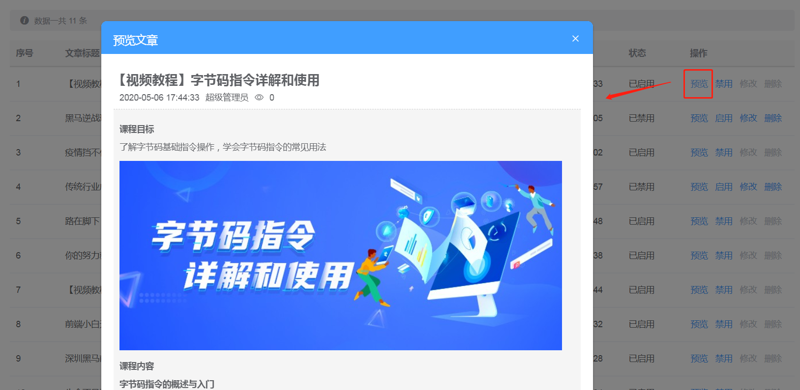

内容包含：

- 文章标题，录入时间，录入人、浏览次数
- 文章内容

#### 8.5禁用启用

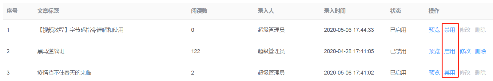

图中的 “禁用” “启用” 按钮根据当前文章的状态来渲染。

- 文章已启用：显示 “禁用” 按钮
- 文章已禁用：显示 “启用” 按钮

当用户点击 “禁用” 按钮的时候，提交禁用操作，成功后：提示“操作成功”+更新当前列表。

当用户点击 “启用” 按钮的时候，提交启用操作，成功后：提示“操作成功”+更新当前列表。

#### 8.6新增文章

当用户点击 “新增文章” 按钮的时候，打开对话框：

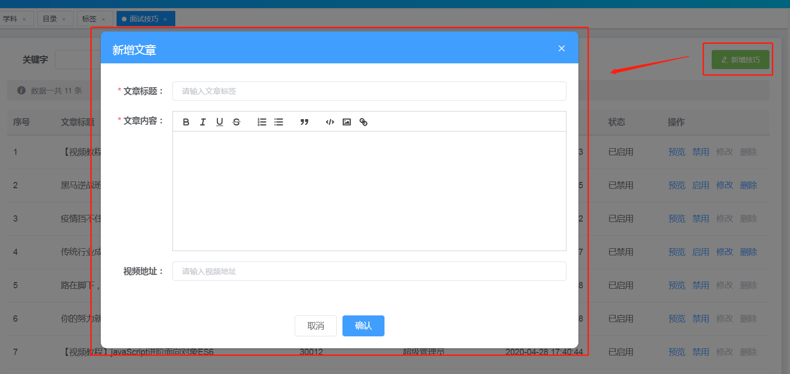

对话框中包含：

- “文章标题” 输入框
- “文章内容” 富文本输入框
- “视频地址” 输入框

当用户点击确认按钮的时候进行校验：

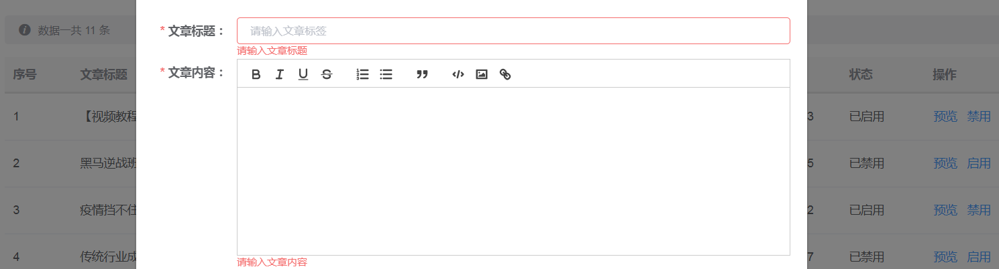

如果校验通过，提交新增请求，处理成功后：提示“新增文章成功”+更新第一页列表。

#### 8.7修改文章

当用户点击 “修改” 按钮的时候，打开对话框：

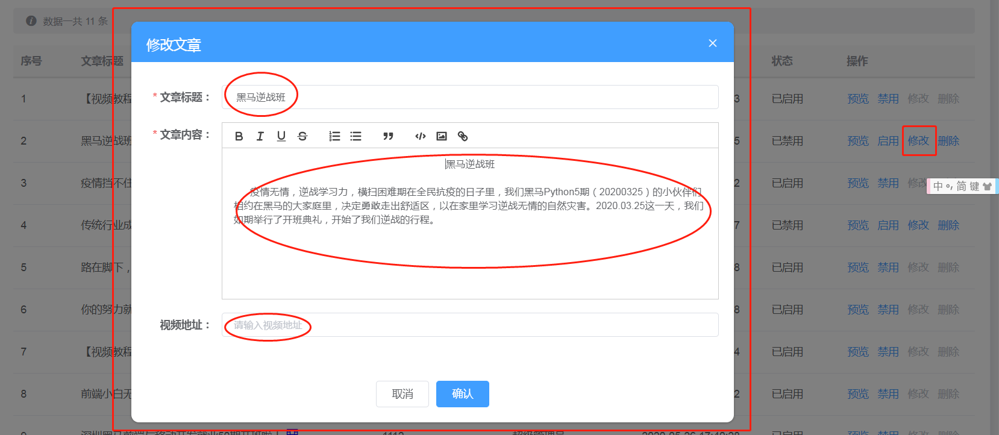

表单中的内容需要填充当前修改文章的数据，然后进行修改。

当用户点击确认的时候，需要进行基本校验，然后提交修改操作，处理成功后：提示“修改文章成功”+根据当前列表。

#### 8.8 删除文章

当用户点击删除按钮，弹出警告确认框：

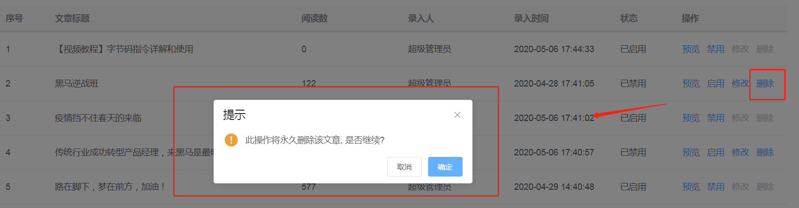

点击确认按钮，进行删除操作，如果操作成功：提示“删除成功”+更新当前列表

